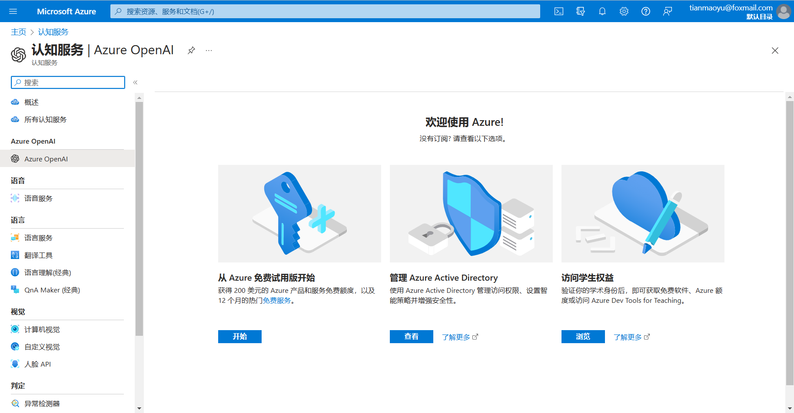
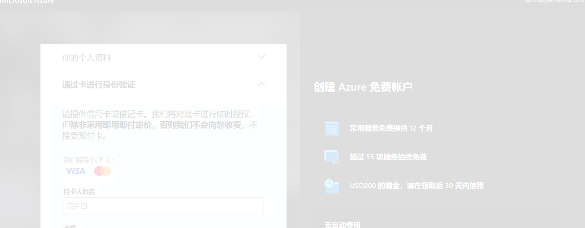
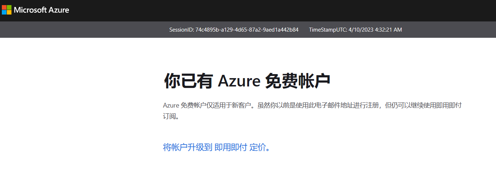
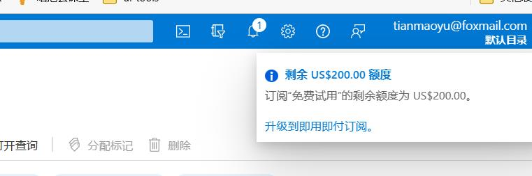
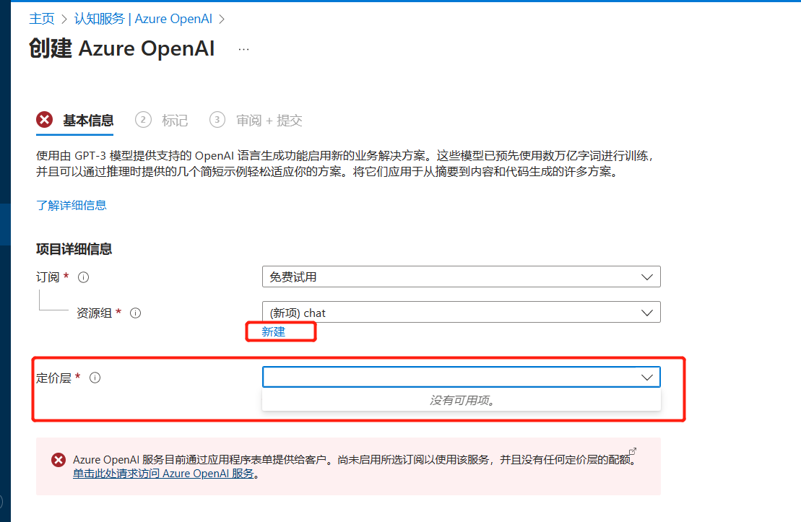
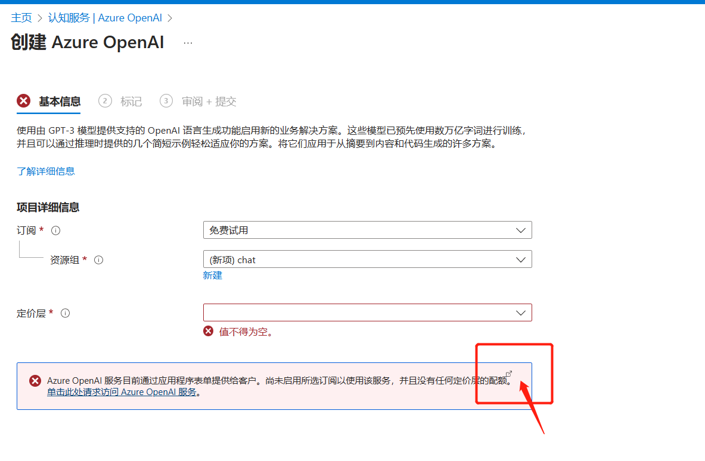
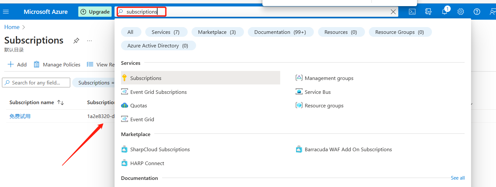
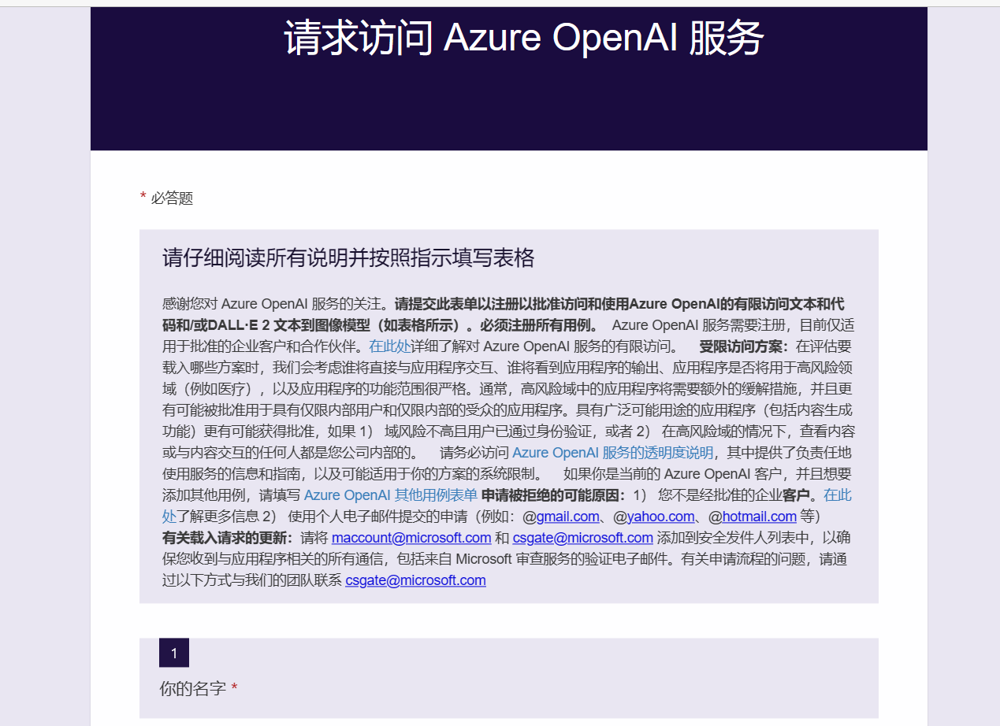

### 使用azure元申请免费的 chatgpt api

### 一，注册登录  Azure

[立即创建 Azure 免费帐户 | Microsoft Azure](https://azure.microsoft.com/zh-cn/free/)

### 二，open ai 目录

> https://portal.azure.com/?quickstart=true#view/Microsoft_Azure_ProjectOxford/CognitiveServicesHub/~/OpenAI

[认知服务 - Microsoft Azure](https://portal.azure.com/?quickstart=true#view/Microsoft_Azure_ProjectOxford/CognitiveServicesHub/~/OpenAI)

三，填写相关质料，个人信息，信用卡（visa）扣1美元款后，会退回

创建成功

#### 三，申请OpenAi的接口

访问地址： [认知服务 - Microsoft Azure](https://portal.azure.com/?quickstart=true#view/Microsoft_Azure_ProjectOxford/CognitiveServicesHub/~/OpenAI)

### 填写申请信息

获取一些提前的信息

订阅id

接着是公司信息，注意现在chatgpt只支持公司申请，不要使用免费邮箱，使用自己公司邮箱即可。

