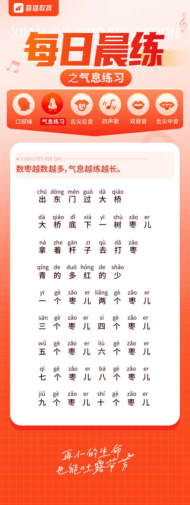
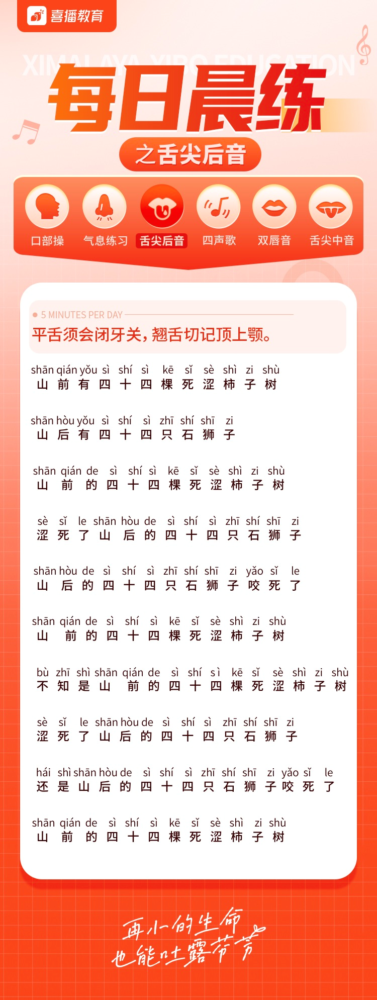
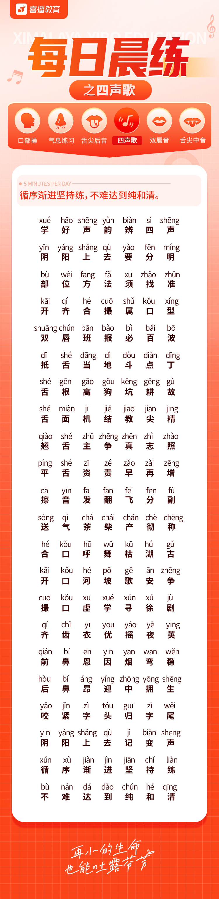
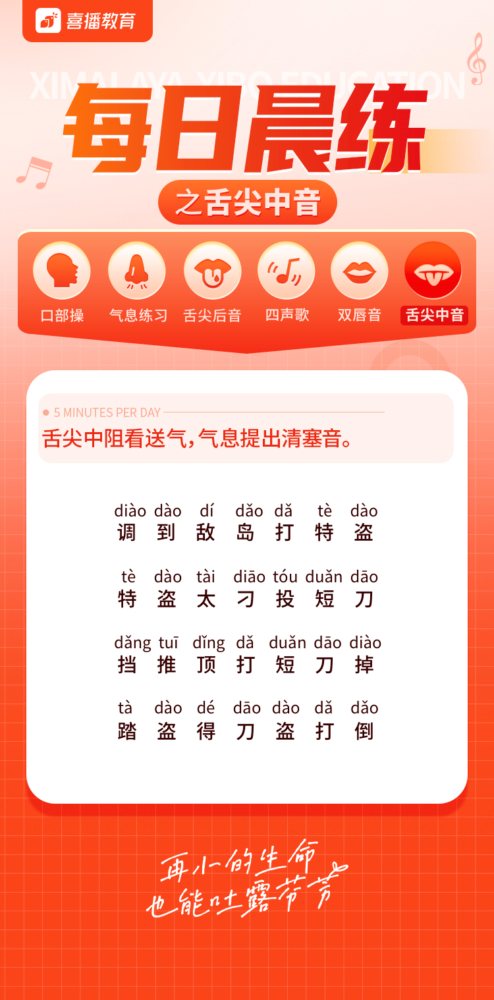

# 普通话基础发声训练手册


## 一，口腔训练

口部训练以唇舌力量的练习为主，常做口部操，可以有效地 加强唇舌力量，提高唇舌灵活程度，使发出的声音干净明亮集中。

### 1.1 嘴的练习

 主要训练张合和咀嚼

#####  一、口的开合练习 

张开嘴打哈欠（打槽牙，挺软腭），闭嘴如啃苹果（松下 巴）。 

#####  二、口的合练习 

开口的动作要柔和，嘴角向斜上方抬起，上下唇稍放松，舌 自然平放 。

##### 三、咀嚼练习

 张口咀嚼与闭口咀嚼结台进行，舌自然平放。练习时反复做， 可提升口部肌肉力量。


### 1.2 双唇的练习

 嘴唇是发声过程中最重要的器官之一，大部分发音都需要嘴 唇的参与。所以，对双唇的锻炼，也有助于语音发声更加情系明 朗

##### 一, 喷：

也称作双唇打响。双唇紧闭，将唇的力量集中于唇中央三分 之一的部位，唇齿相依不裹唇，阻住气流，然后突然连续喷气出 声。合口呼、撮口呼撮唇不好的人可以多练

##### 二、咧：

将双唇闭紧尽力向前噘起，然后将嘴角用力向两边伸展（咧 嘴），反复进行

##### 三、撮：

双唇闭紧向前噘起，然后向左歪、向右歪、向上抬、向下压

##### 四、绕：

双唇闭紧向前噘起，然后向左歪或向右做360度的转圈运动


### 1.3 舌的练习

##### 一、刮舌：

舌尖抵下齿背，舌体贴住齿背，随着张嘴，用上齿 沿舌面刮，尽力加大舌面上翘的拱度，目的在于增加舌面拱起的 力量。 

##### 二、顶舌：

闭唇，用舌尖顶住左内颊，用力顶，可把舌源码想 象成针尖，用力去扎破口腔这个球。然后，用舌尖顶住右内颊， 做同样练习。 

##### 三、伸舌：

将舌伸出唇外，舌体集中，舌尖向前，向左右、向 上下说力伸展。意念上尽量把舌尖想象成一个点，使舌尖慢速、 用力向外伸，多做这个练习，可使舌体集中、舌尖能集中用力。 

##### 四、绕舌：

闭唇，把舌尖伸到齿前唇后，向顺时针方向环绕 360度，然后向逆时针方向环绕360度，交替进行。 

##### 五、立舌：

将舌尖向后贴住左侧槽牙齿背，然后将舌沿齿背推 至门齿中缝，使舌尖向右侧力翻，然后做相反方向的练习。 

##### 六、舌打响：

舌尖与硬腭接触打响。将舌尖顶住硬腭，用力持 阻，然后突然弹开，发出类似de的响声


#### 口部操-练习视频参考

<video  height="500" src="vedio/口腔练习.mp4"></video>


## 二，声母发音部位和方法


### 2.1 双唇音 ： b p m 

发音部位：双唇紧闭，舌位相对比较自由 

##### 重点提示： 

1. 发音唇舌无力，口腔松软的原因与这三个音发不好有直接关 系 
2. 唇部收紧，接触有力，并注意与气息的配合 
3. 力量应集中在双唇中央，不要咧嘴角，不要双唇抿起，否则 会影响音准。 
4. 关气音的气流不能太强 

##### 单音节练习：

班 崩 帮 巴 布 别 保 贝 标 包 泵 宾 

> bān  **bēng**  bāng  bā  bù  bié  bǎo  bèi  biāo  bāo  bèng  bīn  

##### 双音节练习：

包办 奔波 标兵 辨别 遍布 北部 壁报 蚌埠 兵 变 帮办 

> bāo bàn   bēn bō   biāo bīng   biàn bié   biàn bù   běi bù   bì bào   bàng bù   bīng biàn  bāng bàn  

##### 四音节练习：

百发百中 包罗万象 暴跳如雷 跋山涉水 半路出家 博采众长 不约而同

> bǎi fā bǎi zhōng  bāo luó wàn xiàng  bào tiào rú léi  bá shān shè shuǐ  bàn lù chū jiā  bó cǎi zhòng zhǎng  bú yuē ér tóng 

##### 句段练习： 	

八百标兵奔北坡，炮兵并排北边跑，炮兵怕把标兵碰，标兵怕碰炮兵炮。

> bā bǎi biāo bīng bēn běi pō ，pào bīng bìng pái běi biān pǎo ，pào bīng pà bǎ biāo bīng pèng ，biāo bīng pà pèng pào bīng pào 


##### 疑问

拼音： bong 没有字， bēng  **崩** 为什么读不奔 ben  


### 2.2 唇齿音 ： f 

发音部位描述：上唇与下齿接触成阻碍后发出的一种语音 

##### 重点提示： 

1.  上齿与下齿形成阻碍时要自然接触，不要上齿咬住下唇发音， 否则成阻部位面积大，力量分散，发音笨拙。

2.  接触面积不要太大，否则易产生杂音，要条理好气息，除阻 后紧接元音。这样字音更加圆润清晰。

3.  要学佳节制气流，否则容易产生杂音。 


##### 单音节练习：

房 法 翻 发 奋 佛 风 分 否 冯 匪 富 

##### 双音节练习：

丰富 奋发 方法 芬芳 非凡 吩咐 发放 反复 仿 佛 肺腑 防腐 

##### 四音节练习：

发扬光大 风平浪静 风吹草动 翻来覆去 飞沙走 石 分秒必争 风尘仆仆 丰功伟绩 

##### 句段练习： 

1. 粉红墙上画凤凰，凤凰画在粉红墙，红凤凰，粉凤凰，红粉 凤凰，花凤凰 
2. 费家有面粉红墙，粉红墙上画凤凰，凤凰画在粉红墙，红凤 凰、黄凤凰、红凤凰看黄凤凰，黄凤凰看红凤凰，粉凤凰、 花凤凰、粉红凤凰花凤凰，全都仿佛活凤凰


### 2.3 舌尖中音 ：d t n l 

发音部位描述：舌源码抵住上牙龈，气流在这一部位受阻碣后发 出的音 

##### 重点提示： 

1. 我们平常所说的“唇舌无力”的“舌”主要是指舌尖音的发音无 力。 
2. 在演播中最大的问题是气流冲破成阻部位时，舌尖表现无力 度，无弹性，从而使整个字音松散 
3. 注意着力点放在舌尖上，部位要准确，舌尖要有力度 
4. 调整好气息，使受腹部控制的气流，不断地冲击成阻部位， 让舌尖灵活地弹击上齿龈 
5. 舌尖阻被突然冲开，不要拖泥带水 

##### 单音节练习：

到 东 电 推 台 团 吞 能 牛 您 

##### 双部节练习：

等待 到达 大地 跳台 团体 天坛 当代 南宁 恼 怒 奶娘 

##### 四音节练习：

调虎离山 顶天立地 谈虎色变 铁证如山 浓墨重 彩 能说会道 凝眸远望 

##### 句段练习： 

1. 白石塔，白石搭，白石搭白塔，白塔白石搭，搭好白石塔， 白塔白又大 
2. 太阳从西往东少，听我唱个颠倒歌，天上打雷没有响，地上 石头滚上坡；江里骆驼会下蛋，山里鲤鱼搭成窝；腊月酷热 直流汗，六月暴冷打哆嗦；姐在房中手梳头，门外口袋把驴 骑


### 2.4 舌根音 ：g k h 

发音部位描述：指舌根和软腭相连，气流在这一部位受到阻碍后 发出的一种辅音 

##### 重点提示：

1. 他们是21个声母中发音最靠后的三个音，音色也是 属于最暗的一组，要注意舌位有意识地前移，也就是“后单地前 发” 

##### 单音节练习：

钢 公 高 考 坑 口 海 河 欢 

##### 双音节练习：

高贵 光顾 公告 开垦 可靠 空旷 欢呼 荷花 浑 厚 

##### 四音节练习：

广开言路 高谈阔论 纲举目张 甘心情愿 感人肺 腑 各自为政 冠冕堂皇 公而忘私 光彩夺目 

##### 句段练习： 

1. 哥挎瓜筐过宽沟，赶快过沟看怪狗，光看怪狗瓜筐操，瓜滚 筐扣哥怪狗 
2. 华华有两朵黄花，红红有两朵红花，华华要红花，红红要黄 花，华华送给红红一朵黄花，红红送给华华一朵红花


### 2.5 舌面音：j q x 

发音部位描述：指舌面前部抵住或接近硬腭前部，气流在这一部 位受到阻碣后形成的音

#####  重点提示： 

1. 这组音最容易出现源码音（舌尖化）的问题，有了源码音， 普通话发音则非常不标准。为了防止尖音出现，除了做好辩音外， 注意不要让舌尖碰到牙齿或跑到两齿之间。 
2. 发j q x 音时部分人舌尖下垂至下齿龈，舌尖后移，可能是 受方言的影响，所以发音时要找准发音部位。

#####  单音节练习：

江 金 决 情 球 前 新 小 校 

##### 双音节练习：

交际 境界 建交 亲切 气球 齐全 学习 喜讯 现 象 

##### 四音节练习：

皆大欢喜 惊天动地 千载难逢 求同存异 喜出望 外 

##### 句段练习：

 七加一，七减一，加完减完等 于几？七加一，七减一，加完减 完等于七


### 2.6 舌尖后音（翘舌音）：zh ch sh r 

发音部位描述：舌尖与齿龈后部硬腭前缘接触或接近构成阻碍后 发出的一种辅音 

##### 重点提示： 

1. 这组音又叫翘舌音，它发音时易和舌尖前音相混 
2. 从部位上说，一种情况是这组声母发的比较靠后，把翘舌音 发成了卷舌音，要着重练习翘起这个动作，另一个是发音偏前， 舌位较平，接近于平舌音的位置，舌尖要尽量后移顶住硬腭前部， 再发舌尖后音，听起来就不那么偏前了 
3. 发音时注意下巴松弛，牙关打开，气息通畅 

##### 单音节练习：

中 周 抓 插 颤 吃 顺 声 说 然 如 

##### 双音节练习：

庄重 转折 指针 长城 穿插 乘车 山水 闪烁 神 圣 仍然 容忍 

##### 四音节练习：

掌上明珠 郑重其事 畅所欲言 沉默寡言 深入人 心 神采奕奕 入情入理 

##### 句段练习： 

1. 认识从实践始，实践出真知，知道就是知道，不知道就是不 知道，不知道说不知道，也不要不知道装知道，老老实实， 实事求是，一定要做到不折不扣的真知道 
2. 史老师，讲时事，常学实事长知识，时事学习看报纸，打印 纸登的是时事，心里装关下事


### 2.7 舌尖前音（平舌音）：a c s 

发音部位描述：舌尖平伸抵住或接近上齿背，气流在这一部位受 到阻碍后发出的音 

##### 重点提示： 

1. 一定要部位准确，舌尖与要上齿背成阻而不是舌前部整个贴 在上齿背或齿龈上，否则舌中部无力
2.  成阻面要小，力量要集中 
3. 避免舌尖伸到两齿中间变成齿音音 

##### 单音节练习：

咱 最 醋 层 思 色 

##### 双音色练习：

总则 自尊 猜测 苍翠 琐碎 松散 

##### 四音节练习：

自得其乐 再接再厉 沧海桑田 草草了事 司空见 惯 丝丝入扣 

##### 句段练习： 

1. 早晨早早起，早起做早操，人人做早操，做操身体好 
2. 刚往窗上糊字纸，你就隔着窗户撒字纸，一次撕下横字纸， 一次撕下竖字纸，横竖两次撒了四十四张湿字纸，是字纸你就撕 字纸，不是字纸你就不要胡乱撕一地纸 
3. 四是四，十是十，十四是十四，四十是四十，四十加上四， 就是四十四，四，十，十四，四十四，要是说错了，就要误大事


## 三，气息练习——慢吸慢呼 

##### 一、闻花 

立定站稳或一只脚稍向前，双目平视前方，头正，双肩放松， 用鼻子吸上一口新鲜的空气，这是你似乎闻到了花的芬芳。你会 觉得肺的下部及腰部都充满了气息，感觉气入丹田。保持几秒钟， 然后再轻轻呼出。 

##### 二、“a”音延长 

 用慢吸慢呼的动作，发单无音“a”的延长音。用自己最舒服的 声音，声音逐渐由小到大，由底到高，由近到远，由弱到强，气 息要通畅自如。下腭、舌根不紧张，喉部放松，让气流集中地打 到硬腭前端发出。 

##### 三、数数练习 慢 

吸气吸八成满，呼气时数1、2、3、4、5、6……，数的速度 要慢，吐字要清楚，嘴上用力，不要紧张；发一个音后马上闭住 别跑气、换气，吼要松，气要通，直至一口气数完，能数多少就 数多少，逐渐增加


### 一，气息练习




<video src="vedio/呼吸训练.mp4"></video>


##### 气息练习文本：数枣

> 出chu 东门，过大桥，大桥底下一树shu 枣儿，拿着zhe 杆子zi去 打枣zao ，青的多，红的少shao，
> 一个枣zao儿，两个枣儿，
> 三san个枣儿，四个枣儿，
> 五个枣儿，六个枣儿，
> 七个枣儿，八个枣儿，
> 九个枣儿，十个枣儿。
> 十shi个枣儿，九个枣儿，
> 八个枣儿，七个枣儿，
> 六个枣儿，五个枣儿，
> 四个枣儿，三个枣儿，
> 两个枣儿，一个枣儿，
> 这是一段绕口令，一口气说完才算好。


### 播音演示练习

```
这zhè天，狐狸挑了一个奇怪的担子。
这zhè担子zǐ看着zhe像手表，有一个像表针zhēn一样的指针zhǐ zhēn，
四sì周 zhōu有许多小格子，每隔一个空格子，
里面就会放上shàng许多好吃chī、好玩的东西。
狐狸告诉大家，交一块钱就可以拔这个指针 zhǐ zhēn，指针指向哪个格子，里面的东西就是它的。当然，如果指针指向空格子就什shí么 me 也没有了，小动物们看见这些东西高兴极了，都跑去玩，
谁知除shuí zhī chú 了最zuì先几个动物赢了之外，其余全都输 shū了。
小猫咪觉得奇怪了。晚上，它趁狐狸睡着了之 zhī后，跑到狐理那里看了看那个担子，发现了问题，便用手shǒu拨弄了几下，
第二天，小猫咪带了许多小动物来玩，
狐狸总zǒng输shū ，到最后它终于沉不住气了大喊：“不玩了，不玩了！”
小猫咪气愤地说：“哼，我也不跟你玩了，你太狡猾了。”
原来，小猫咪把磁铁全移了位，所以狐狸才总输
```


### 晨练二，舌尖后音


<video src="vedio/舌尖后音.mp4"></video>





### 练习四，四声哥

<video src="vedio/四声哥.mp4"></video>





### 练习五，舌尖中音

<video src="vedio/舌尖中音.mp4"></video>




### 角色塑造

角色塑造的 四种方法：

1. 生意形象的塑造
2. 身份气质的塑造
3. 胸腔部分震动（深层），头部震动（明亮，小孩）


**塑造声音形象： 共鸣腔体，气息控制，语速快慢，**

**体现身份气质：态度，表情，气息，尾音**

语速变化，

气息，尾音，态度，表情：
